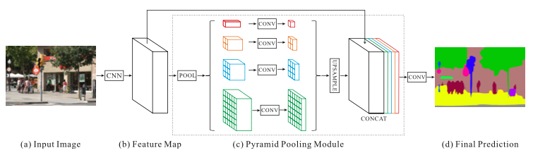
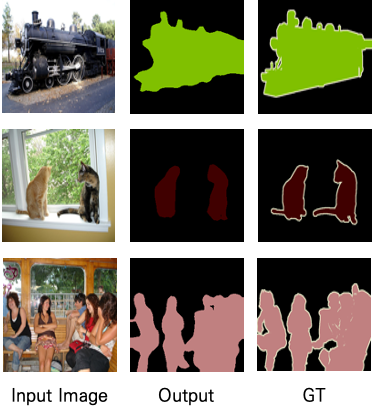

# PSPNet-Pytorch
Pyramid Scene Parsing Network CVPR 2018 Implementation

</img>

## Example Results
</img>

## Usage
### Prerequisites
- Python 3.7
- Pytorch 1.7.1
- TorchVision 0.8.2

### Getting Started
#### Installation
Clone this repo:
```bash
git clone https://github.com/SuhyeonHa/PSPNet-Pytorch
cd PSPNet-Pytorch
```
#### Dataset
- [Pascal VOC 2012](http://host.robots.ox.ac.uk/pascal/VOC/voc2012/)

#### Model Training
```bash
train.py --isTraining True
```
Please check configuration part first in '__main__' of main.py for adjusting dicterory paths and batch size etc..

#### Use a Pre-trained Model
- Download a Pre-trained generator [here](https://drive.google.com/file/d/1B9YjJE6qF57Gyj75VlXcUBl_8y4YcqZm/view?usp=sharing)
```bash
test.py --isTraining False
```

